# Memoria.md - Lab6 - Microservices
First we run the Eureka Server.
It is ready for registering new services.
Then we run the first "Account" microservice and we check Eureka:
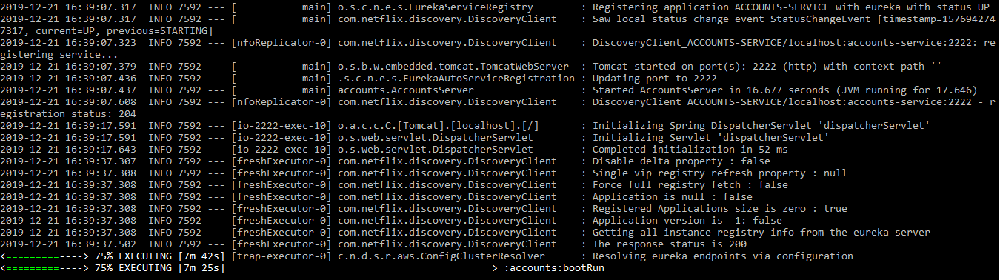
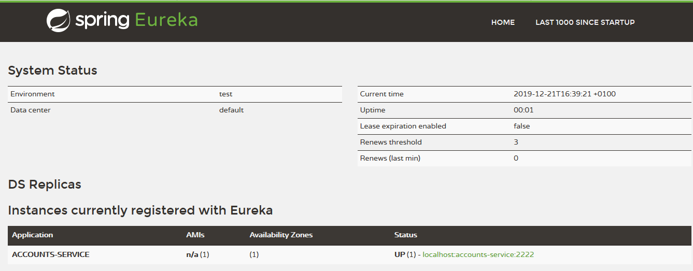

Re-check Eureka after running the "Web" microservice:
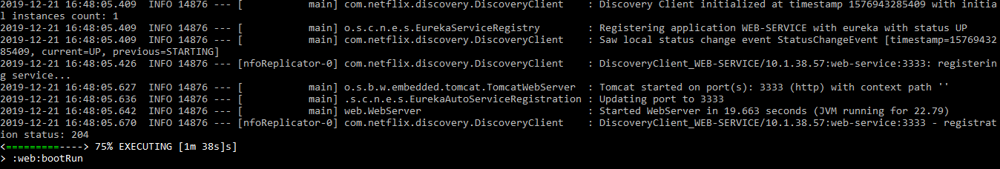
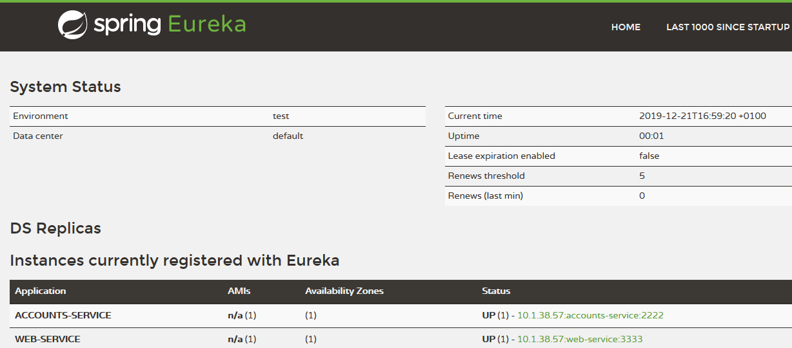

Finally change the port in application.yml to 4444 for running the second "Account" microservice:
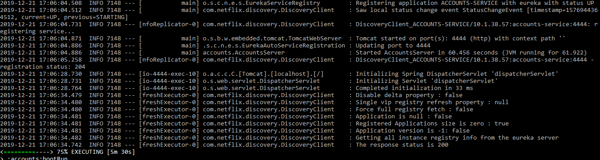
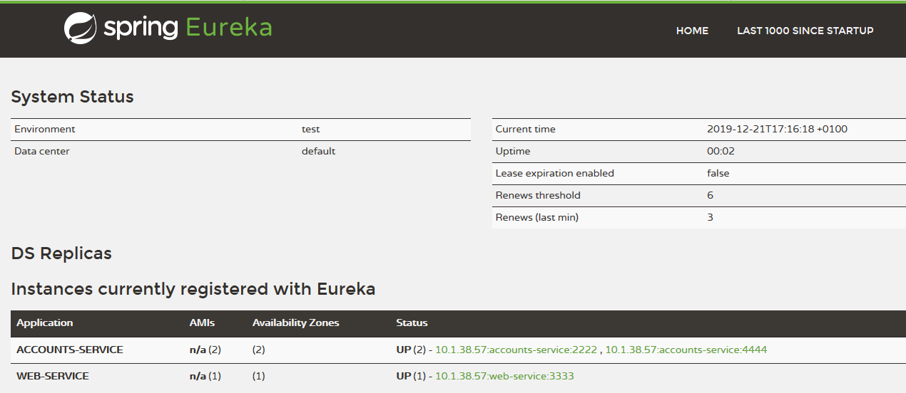

What happens when we kill the microservice with port 2222?
The web server could show us both "Account" instances:
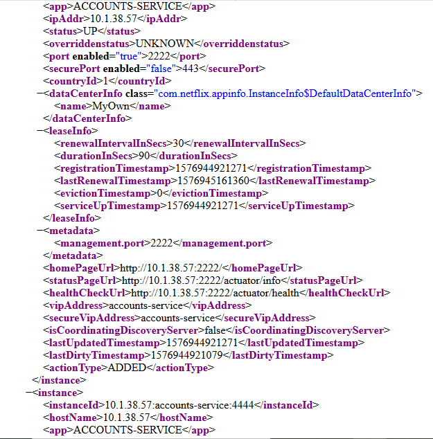

After killing the one in server 2222:
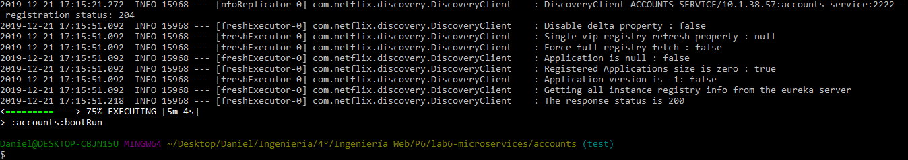

The web server shows:
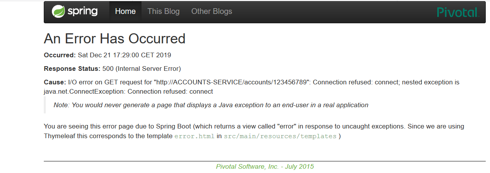

But it still knows about the tow instances of the "Account" microservices:
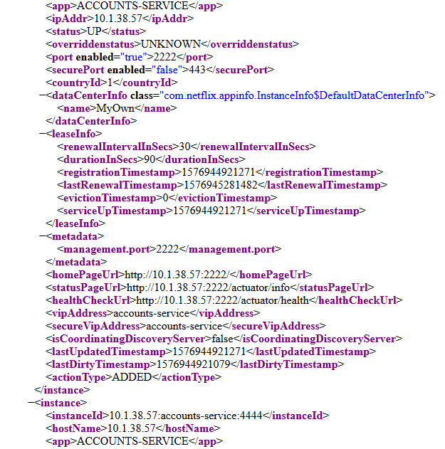

After refreshing, the server can still find the account because it has gotten the info of 
the replica microservice on port 4444:
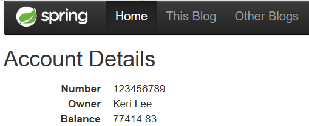
